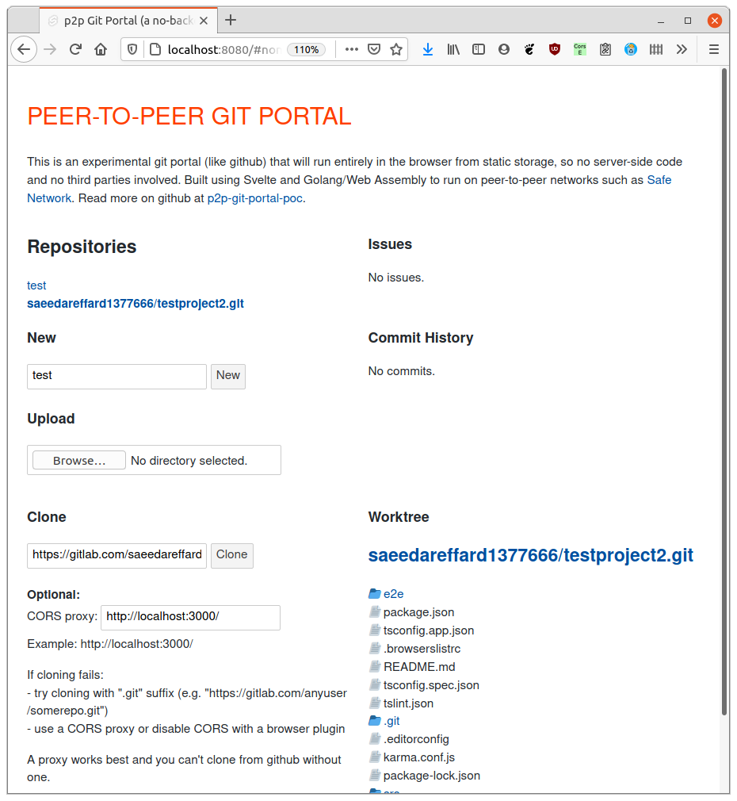

# p2p Git Portal - Proof of Concept

Git Portal is a github style sharing and collaboration application without server side code (no-backend).

- The aim is to provide an alternative to the centralisation of github and similar third party hosted services, and to avoid the need to self host such a service.
- The approach is to provide web front end in a static application which can run in a browser directly from static or peer-to-peer storage without the need for server side code.
- The benefit of this will be the convenience of a web application, without dependence on a third party and avoiding the vulnerabilities associated with servers and centralised services.

In just a few weeks this project as received a lot of encouragement which has been amazing!

**Hashtag #gitportal:** [Mastodon](https://mastodon.technology/web/timelines/tag/gitportal) | [Twitter](https://twitter.com/hashtag/gitportal)

**Chat (matrix/element):** [#gitportal](https://riot.im/app/#/room/#gitportal:matrix.org)

**Forum (discourse):** [Git Portal Discussion](https://safenetforum.org/t/safenetwork-git-portal-discussion/32793?u=happybeing)

## Screenshot


## Using The Demo
A recent live demo is available at http://gitch.happybeing.com. That is a static HTML no-backend app (so no-server side code). 

You can create or upload repositories immediately using the buttons provided, but in order to clone a repository need to use a proxy or a browser plugin to avoid problems with CORS checks in the browser. A proxy is necessary for github, but a browser plugin is enough for some git services such as gitlab. See the [section on CORS](#setup-a-cors-proxy) if you wish to try out the clone feature.

Once you have a repository stored in Git Portal you will be able to browse the file worktree and .git directories, view commits (if any), and view issues (a few example issues are added when you create a new repository).

The UI does not yet allow you to create or edit issues.
## Objective
The initial objective has been achieved: to establish feasibility of a Git Portal app which can run from static web hosting or from the peer-to-peer storage such as [Safe Network](https://safenetwork.tech) (a secure, anonymous, private peer-to-peer storage and communications platform). 

Following this we will plan and develop a functional Git Portal product for Safe Network. 

The proof-of-concept could be adapted for use on with any decentralised storage, and be the basis for other ambitious peer-to-peer git related projects.
## Approach

The proof-of-concept / demonstration utilises Golang/Wasm with Svelte front-end, in order to make use of functionality provided in Golang by `git-bug` (which adds issues to git functionality without polluting the commit history).

For the product we will move away from Golang due to performance and security concerns, and are looking eventually to a Rust/Wasm solution, while using existing libraries where this can speed development (e.g. JavaScript git functionality).

The product will remain compatible with `git-bug` at the filesystem level in order to make use of its proven design, continued enhancements (e.g. to support git PRs), and excellent command line interface (as a 'git extra').
## Proof of Concept Summary
### Architecture

- Svelte UI plus Golang/Wasm using Golang wasm webpack plugin
- *in the browser* 'no-backend' with go-git/go-billy and git-bug (Golang/wasm)

### Features
- initialise, clone or upload repository 
- list repositories
- select and interact with a repository
- browse the worktree, commits and issues
- create/view/edit issues and comments

## Current Status

Most of the above feautures are either working or proven to be feasible by the work done so far. The UI has begun to take shape and while work continues to extend demo features, we're now planning development into a product.

Remaining activity for the proof-of-concept:

### Activity & Opportunities to Help

#### Proof-of-Concept
- **Features and UI** - Work continues to extend and improve functionality and UI based on the current Go/Wasm no-backend, and Svelte/Tailwind CSS front-end. Suggestions and discussion of UI/UX are welcome on [#issue 1](https://github.com/happybeing/p2p-git-portal-poc/issues/1). **Help is welcome** with several small tasks in Svelte front-end and Golang no-server no-backend, but these are not yet written down. So ask if you may be able to help and I will begin to turn my thoughts into tasks with your prompting. Bigger tasks will flow from this if you want to help design or implement the features and API providing these to the front-end. 

- **git-bug** work is adequate for now, so no further work is being done although we may update this in collaboration with the `git-bug` author. This is not necessary long-term though, see next.

#### Git Portal Product
- **Work on a product** is at the investigation and planning stage. The first product will follow the lead of existing portals, notably github in terms of functionality and user experience. Being similar shows both what we are, and what we still need to do in order to meet expectations.


	The implementation is likely to involve JavaScript and Rust/Wasm, shifting from the former to the latter over time and as development resources permit.

- **Git Portal Vision** 
	From a peer-to-peer alternative to github and similar third party git portal services, we will develop our vision for a community driven and oriented feature set with our own visual identity. This means re-inventing the git portal without the goal of centralisation, and instead to share and return value created by the community in whatever ways the community can benefit.
## Development
To participate in development you will need to set-up as follows.
### Pre-requisites

Install Golang v1.15, `node` v14.14 and `yarn` v1.22. You could use `npm`, I just prefer `yarn`.

I recommend using `nvm` (node version manager to install `node`) and `gvm` (Go version manager to install Golang) as it makes it easier to install, upgrade and switch between versions of these dependencies.

### Get the Code

If you have `node` and `yarn` installed, on Linux you should be able to just copy the following and paste it into your terminal.
``` bash
# Make sure GOROOT and GOPATH are set in the terminal, for example:
export GOROOT=`go env GOROOT`
export GOPATH=`go env GOPATH`

# Get the app
mkdir -p ~/src/go_wasm
cd ~/src/go_wasm
git clone https://github.com/happybeing/p2p-git-portal-poc
cd  p2p-git-portal-poc
yarn && yarn build

# If all looks good, start the app
yarn dev
# Open app in the browser by visiting localhost:8080
```

### Setup a CORS Proxy
To clone repositories you will need a way to overcome CORS errors because we're working entirely within the web browser. You can try disabling this with a browser plugin, and this works with some services but not github.

So I recommend using a CORS proxy. You can set one up locally as follows:
```bash
	git clone https://github.com/wmhilton/cors-buster
	cd cors-buster && yarn && yarn start
```

### Testing
The above is all that's needed to test and for most development.

Make sure you have the proxy running and make sure the proxy URI is set correctly in the UI. Now click "Clone". 

A sample repository is already set in the UI, and should be cloned in a few seconds. Large repositories will of course take much longer, so be prepared to wait!

When cloning is finished this the list of repositories on the top left, and the list of commits on the right will be updated. If you have more than one repository cloned, you can click on the list (top left) to show the commits for that repository.

If you have problems, open the web browser console to look for any error messages and feel free to open an issue if you have difficulties.

Note: drag and drop of files is not properly supported yet.

### Development
Hot reloading generally works well, but if you have problems getting rid of a compilation error after you think you've fixed it, restart the `yarn dev` command.

If you want to make changes to the Go/wasm plugin or to any go packages used by this project, you must set up local versions under your `go/src` directory and modify your `./go.mod` to use these rather than download them. For example, my `./go.mod` includes 'replace' statements for each package I'm working on locally:

```golang
replace github.com/MichaelMure/git-bug => /home/mrh/src/go/src/github.com/happybeing/git-bug

```

### Code Documentation
You can view **developer documentation** for local code and package dependencies in a web browser, showing functions, types etc. for each package.

To view developer documentation:

- Install `godoc` using `go get` / `go install`. Linux users may install directly from their package repositories but this may not be as up-to-date (e.g. `sudo apt install godoc`).

In the directory next to the `go.mod` of the code you wish to browser (e.g. `./p2p-git-portal-poc/src`), run the following but be patient as first time it takes a while to generate the docs and doesn't show any progress in the terminal.
```bash
# This updates the documentation and then acts as a web server
godoc -http=":6060"
```
Then visit `http://localhost:6060` and click 'Packages' and search the page for the package you want to browse (e.g. `git-bug`)


### Contributions
If you wish to build or contribute to the code, get in touch and I'll add some build instructions as it requires some special setup using my fork of a webpack wasm plugin. Not hard, but not obvious!

## LICENSE

Everything is GPL3.0 unless otherwise stated. Any contributions are accepted on the condition they conform to this license.

See also [./LICENSE](./LICENSE)